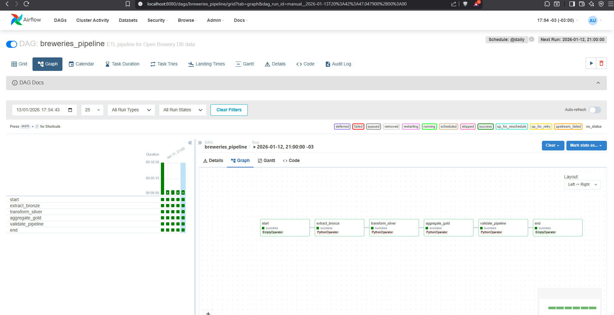
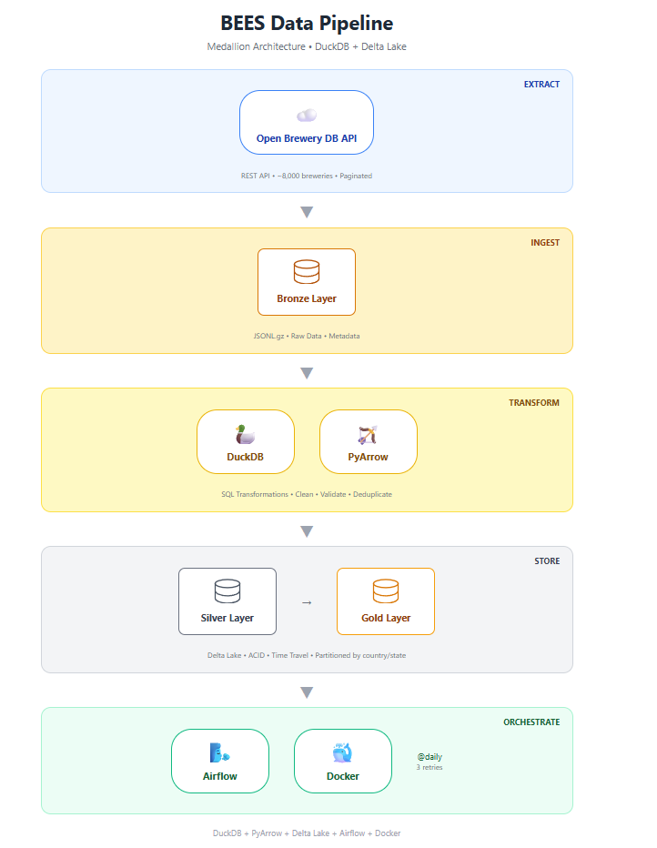

---

# BEES Data Engineering – Breweries Pipeline

[](https://www.python.org/downloads/)
[](https://airflow.apache.org/)
[](https://www.docker.com/)
[](https://duckdb.org/)
[](https://delta.io/)
[]()

A data pipeline solution for the BEES/AB-InBev Data Engineering case. This project consumes data from the [Open Brewery DB API](https://www.openbrewerydb.org/), transforms it following the **Medallion Architecture**, and provides a **transactional and versioned analytical layer**.

## 📋 Table of Contents

- [Overview](#overview)
- [Architecture](#architecture)
- [Project Structure](#project-structure)
- [Tech Stack](#tech-stack)
- [Getting Started](#getting-started)
- [Running the Pipeline](#running-the-pipeline)
- [Pipeline Layers](#pipeline-layers)
- [Orchestration](#orchestration)
- [Testing](#testing)
- [Monitoring & Alerting](#monitoring--alerting)
- [Design Decisions](#design-decisions)
- [Trade-offs](#trade-offs)

---

## Overview

This pipeline fetches brewery data from a public API and processes it through three layers:

1. **Bronze (Raw)**: Raw data persisted as-is from the API in JSONL.gz format
2. **Silver (Curated)**: Cleaned and transformed data in Parquet format, partitioned by location
3. **Gold (Aggregated)**: Analytical layer with brewery counts by type and location

---

## Architecture

```
┌─────────────────┐     ┌─────────────────┐     ┌─────────────────┐     ┌─────────────────┐
│  Open Brewery   │────▶│     Bronze      │────▶│     Silver      │────▶│      Gold       │
│    DB API       │     │   (JSONL.gz)    │     │   (Parquet)     │     │  (Aggregated)   │
└─────────────────┘     └─────────────────┘     └─────────────────┘     └─────────────────┘
                              │                        │                        │
                              ▼                        ▼                        ▼
                        Raw JSON data           Partitioned by            Breweries per
                        + metadata             country/state             type & location
```

### Airflow DAG Flow

```
start → extract_bronze → transform_silver → aggregate_gold → validate → end
```

---

## Project Structure

```
AB-INBEV/
│
├── config/                      # Configuration files
│   └── config.yaml              # API and pipeline settings
│
├── data/                        # Data Lake (Medallion Architecture)
│   ├── bronze/                  # Raw data from API
│   │   └── breweries/
│   │       └── ingestion_date=YYYY-MM-DD/
│   │           └── run_id=YYYYMMDD_HHMMSS/
│   │               ├── page=0001.jsonl.gz
│   │               └── _manifest.json
│   ├── silver/                  # Transformed parquet files
│   │   └── breweries/
│   │       ├── country=United States/
│   │       │   └── state_province=California/
│   │       └── _SUCCESS
│   └── gold/                    # Aggregated analytical data
│       └── breweries/
│           ├── breweries_by_type_and_location.parquet
│           ├── breweries_by_type.parquet
│           ├── breweries_by_country.parquet
│           └── _summary.json
│
├── doc/                         # Documentation
│   ├── MONITORING.md            # Monitoring & alerting strategy
│   ├── test_brewery_api_client.md
│   ├── test_raw_writer.md
│   ├── test_silver_transforms.md
│   └── test_gold_transforms.md
│
├── orchestration/               # Airflow DAGs
│   └── dags/
│       └── breweries_pipeline.py
│
├── src/                         # Source code
│   ├── clients/                 # API clients
│   │   ├── __init__.py
│   │   └── brewery_api_client.py
│   ├── config/                  # Configuration loader
│   │   ├── __init__.py
│   │   └── configuration.py
│   ├── io/                      # I/O operations
│   │   ├── __init__.py
│   │   ├── raw_writer.py        # Bronze layer writer
│   │   ├── bronze_reader.py     # Bronze layer reader
│   │   └── silver_reader.py     # Silver layer reader
│   ├── pipelines/               # Pipeline implementations
│   │   ├── __init__.py
│   │   ├── bronze_layer.py
│   │   ├── silver_layer.py
│   │   └── gold_layer.py
│   └── transforms/              # Data transformations
│       ├── __init__.py
│       ├── silver_transforms.py
│       └── gold_transforms.py
│
├── tests/                       # Unit tests
│   └── unit/
│       ├── test_brewery_api_client.py
│       ├── test_raw_writer.py
│       ├── test_silver_transforms.py
│       └── test_gold_transforms.py
│
├── .env                         # Environment variables
├── .env.example                 # Environment template
├── .dockerignore
├── .gitignore
├── docker-compose.yml           # Docker Compose configuration
├── Dockerfile                   # Application container
├── Makefile                     # Development commands
├── requirements.txt             # Python dependencies
└── README.md
```

---

## Tech Stack

| Component        | Technology                     |
|------------------|--------------------------------|
| Language         | Python 3.11+                   |
| Data Processing  | **DuckDB** (SQL-based transformations) |
| Data Format      | **PyArrow** (zero-copy, columnar) |
| Storage Format   | **Delta Lake** (ACID transactions, time travel) |
| Orchestration    | Apache Airflow 2.8             |
| Containerization | Docker & Docker Compose        |
| Database         | PostgreSQL 15 (Airflow metadata)|
| Testing          | pytest                         |

### Why DuckDB + PyArrow + Delta Lake?

| Technology | Benefit |
|------------|---------|
| **DuckDB** | High-performance SQL engine, zero configuration, memory efficient |
| **PyArrow** | Native columnar format, zero-copy data sharing, no Pandas overhead |
| **Delta Lake** | ACID transactions, schema enforcement, time travel, efficient upserts |

---

## Getting Started

### Prerequisites

- Python 3.11+
- Docker & Docker Compose
- Git

### Option 1: Running with Docker (Recommended)

```bash
# 1. Clone the repository
git clone https://github.com/JanathanPlanas/AB-inbev.git
cd ab-inbev-breweries

# 2. Create environment file
cp .env.example .env

# 3. Start Airflow
docker-compose up -d

# 4. Access Airflow UI
# URL: http://localhost:8080
# Username: airflow
# Password: airflow
```

### Option 2: Running Locally (Without Docker)

```bash
# 1. Clone the repository
git clone https://github.com/JanathanPlanas/AB-inbev.git
cd ab-inbev-breweries

# 2. Create virtual environment
python -m venv venv
source venv/bin/activate  # Linux/Mac
# or
.\venv\Scripts\activate   # Windows

# 3. Install dependencies
pip install -r requirements.txt

# 4. Run the pipeline
python -m src.pipelines.bronze_layer
python -m src.pipelines.silver_layer
python -m src.pipelines.gold_layer
```

---

## Running the Pipeline

### With Airflow (Docker)

1. Access Airflow UI: http://localhost:8080
2. Find the DAG: `breweries_pipeline`
3. Click the **▶️ Trigger DAG** button
4. Monitor execution in the Graph view

### With Command Line

```bash
# Run complete pipeline
python -m src.pipelines.bronze_layer
python -m src.pipelines.silver_layer
python -m src.pipelines.gold_layer

# Or use Makefile (Linux/Mac)
make run-all
```

### Docker Commands

| Action       | Command                  |
|--------------|--------------------------|
| Start        | `docker-compose up -d`   |
| Stop         | `docker-compose down`    |
| View logs    | `docker-compose logs -f` |
| Check status | `docker-compose ps`      |
| Restart      | `docker-compose restart` |

---

## Pipeline Layers

### Bronze Layer (Raw)

- **Source**: Open Brewery DB API
- **Format**: JSONL.gz (gzipped JSON Lines)
- **Features**:
  - Automatic pagination handling
  - Retry logic with exponential backoff
  - Ingestion metadata (_ingestion_date, _run_id, _ingested_at)
  - Manifest file with run statistics

**Output Structure**:
```
data/bronze/breweries/
└── ingestion_date=2025-01-12/
    └── run_id=20250112_003000/
        ├── page=0001.jsonl.gz
        ├── page=0002.jsonl.gz
        ├── ...
        └── _manifest.json
```

### Silver Layer (Curated)

- **Format**: Delta Lake (with Parquet files underneath)
- **Partitioning**: By `country` and `state_province`
- **Processing**: DuckDB SQL transformations
- **Features**:
  - ACID transactions
  - Schema enforcement
  - Time travel (version history)

**Transformations Applied** (via DuckDB SQL):
  - Column selection (removed deprecated fields: `state`, `street`)
  - Data type standardization (strings, floats)
  - Coordinate validation (lat: -90 to 90, lon: -180 to 180)
  - Deduplication by ID
  - String cleaning (whitespace trimming)
  - Partition column preparation (nulls → "Unknown")

**Output Structure**:
```
data/silver/breweries/
├── _delta_log/                    # Delta Lake transaction log
│   ├── 00000000000000000000.json
│   └── ...
├── country=United States/
│   ├── state_province=California/
│   │   └── *.parquet
│   ├── state_province=Oregon/
│   └── ...
├── country=Ireland/
└── ...
```

**Time Travel Example**:
```python
from deltalake import DeltaTable

# Read current version
dt = DeltaTable("data/silver/breweries")
df = dt.to_pandas()

# Read previous version
dt_v0 = DeltaTable("data/silver/breweries", version=0)
df_old = dt_v0.to_pandas()

# View history
history = dt.history()
```

### Gold Layer (Aggregated)

- **Format**: Delta Lake
- **Processing**: DuckDB SQL aggregations
- **Main Output**: Quantity of breweries per type and location

**Output Tables** (Delta Lake):
| Table | Description |
|-------|-------------|
| `breweries_by_type_and_location/` | Main aggregation (type + country + state) |
| `breweries_by_type/` | Global count by brewery type |
| `breweries_by_country/` | Count by country |
| `_summary.json` | Comprehensive summary |

**Schema** (`breweries_by_type_and_location`):
```
| country       | state_province | brewery_type | brewery_count |
|---------------|----------------|--------------|---------------|
| United States | California     | micro        | 523           |
| United States | California     | brewpub      | 187           |
| Ireland       | Dublin         | micro        | 28            |
```

**Query with DuckDB**:
```python
import duckdb

# Query Delta Lake directly with DuckDB
conn = duckdb.connect()
result = conn.execute("""
    SELECT * FROM delta_scan('data/gold/breweries/breweries_by_type_and_location')
    WHERE country = 'United States'
    ORDER BY brewery_count DESC
    LIMIT 10
""").df()
```

---

## Orchestration

The pipeline is orchestrated using **Apache Airflow** with the following features:

### DAG Configuration

| Setting | Value |
|---------|-------|
| Schedule | `@daily` (00:00 UTC) |
| Retries | 3 |
| Retry Delay | 5 minutes (exponential backoff) |
| Execution Timeout | 1 hour |
| Catchup | Disabled |

### Airlfow Configuration
 


### Tasks

1. **start** - Pipeline start marker
2. **extract_bronze** - Fetch data from API → Bronze layer
3. **transform_silver** - Transform Bronze → Silver (Parquet)
4. **aggregate_gold** - Aggregate Silver → Gold
5. **validate_pipeline** - Data quality validation
6. **end** - Pipeline end marker

### Error Handling

- Automatic retries with exponential backoff
- Failure callbacks for alerting
- XCom for passing metrics between tasks
- Validation task to check data consistency

---

## Testing

### Running Tests

```bash
# Run all tests
pytest tests/ -v

# Run with coverage
pytest tests/ -v --cov=src --cov-report=html

# Run specific test file
pytest tests/unit/test_brewery_api_client.py -v
```

### Test Coverage

| Module | Tests | Coverage |
|--------|-------|----------|
| API Client | 12 | ✅ |
| Raw Writer | 17 | ✅ |
| Silver Transforms | 18 | ✅ |
| Gold Transforms | 18 | ✅ |
| **Total** | **65** | ✅ |

### What's Tested

- API client pagination and error handling
- File I/O operations (read/write)
- Data transformations (types, nulls, validation)
- Aggregation logic
- Edge cases (empty data, unicode, duplicates)

---

## Monitoring & Alerting

See [doc/MONITORING.md](doc/monitoring.md) for the complete monitoring strategy.

### Summary

| Aspect | Implementation |
|--------|----------------|
| Pipeline Failures | Airflow alerts, retry logic, failure callbacks |
| Data Quality | Row count validation, schema checks, null monitoring |
| Logging | Structured logs with timestamps |
| Metrics | XCom for cross-task metrics |

### Recommended Tools (Production)

- **Observability**: Datadog, Grafana, Prometheus
- **Data Quality**: Great Expectations
- **Alerting**: Slack, PagerDuty

---

## Design Decisions

| Decision | Rationale |
|----------|-----------|
| **JSONL.gz for Bronze** | Preserves raw data, good compression (~70-80%), streaming reads |
| **Delta Lake for Silver/Gold** | ACID transactions, time travel, schema evolution, efficient upserts |
| **DuckDB for transformations** | High-performance SQL, zero config, memory efficient, modern |
| **Partition by country/state** | Balanced partition sizes, enables efficient querying |
| **Airflow for orchestration** | Industry standard, rich ecosystem, good UI for monitoring |
| **Docker Compose** | Easy local setup, reproducible environment |

### Why DuckDB + PyArrow over Pyspark?

For ~8k rows, DuckDB + PyArrow provides excellent performance with minimal dependencies.

### Why Delta Lake over Parquet?

| Feature | Delta Lake | Parquet |
|---------|------------|---------|
| **ACID transactions** | ✅ | ❌ |
| **Time travel** | ✅ | ❌ |
| **Schema evolution** | ✅ | ❌ |
| **Upserts/Merges** | ✅ | ❌ |
| **Audit history** | ✅ | ❌ |

Delta Lake adds lakehouse capabilities on top of Parquet.

---

## Trade-offs

| Trade-off | Decision | Alternative |
|-----------|----------|-------------|
| **Storage** | Local filesystem | S3/GCS/ADLS for production |
| **Processing** | Batch (daily) | Streaming if real-time needed |
| **Compute** | Single node (duckdb + pyarrow) | Spark for larger datasets |
| **Database** | PostgreSQL (Airflow) | Managed service (Cloud Composer, MWAA) |
| **Secrets** | .env file | Vault, AWS Secrets Manager |

---

## Future Improvements

- [ ] Add Great Expectations for data quality
- [ ] Implement incremental loading (only new breweries)
- [ ] Add Slack/Teams notifications
- [ ] Deploy to cloud (AWS/GCP/Azure)
- [ ] Add CI/CD pipeline (GitHub Actions)
- [ ] Implement data versioning (Delta Lake)

---
  ## Architecture
  
  

## Author

**Janathan**    
Data Engineer

---

## License

This project was created as part of a technical assessment for AB-InBev/BEES.
