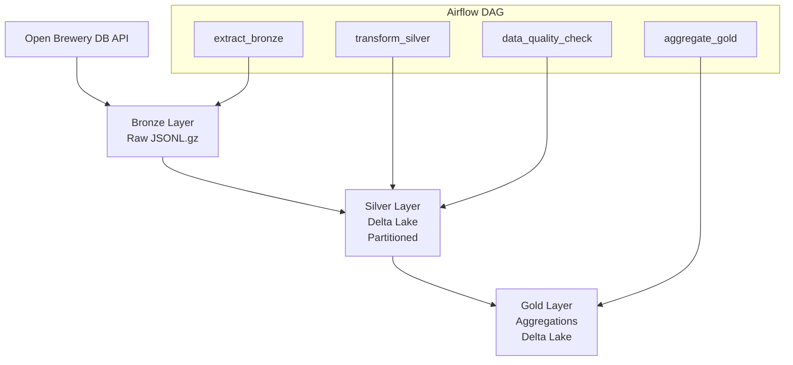

Perfeito — agora faz **todo sentido atualizar o README**, porque ele ainda descreve o **modo antigo (Pandas + Parquet)** e isso **contradiz o código atual**, que está **bem mais forte tecnicamente**.

Abaixo está um **README atualizado**, alinhado com:

* ✅ **DuckDB (SQL engine)**
* ✅ **Delta Lake (ACID, versionamento, time travel)**
* ✅ **Sem pandas**
* ✅ **Case técnico com maturidade de Data Engineering**

Você pode **substituir o README inteiro** por este conteúdo 👇

---

# BEES Data Engineering – Breweries Pipeline

[](https://www.python.org/downloads/)
[](https://airflow.apache.org/)
[](https://duckdb.org/)
[](https://delta.io/)
[](https://www.docker.com/)
[]()

A complete **Data Engineering pipeline** built for the BEES / AB-InBev technical case.
The project ingests data from the **Open Brewery DB API**, processes it following the **Medallion Architecture**, and delivers a **transactional, versioned analytical layer** using **DuckDB + Delta Lake**.

---

## 📋 Table of Contents

* Overview
* Architecture
* Project Structure
* Tech Stack
* Getting Started
* Running the Pipeline
* Pipeline Layers
* Orchestration
* Testing
* Monitoring & Alerting
* Design Decisions
* Trade-offs
* Future Improvements

---

## Overview

This pipeline ingests brewery data from a public API and processes it through three layers:

1. **Bronze (Raw)**
   Raw API data stored as-is in compressed JSONL format.

2. **Silver (Curated)**
   Cleaned and standardized data processed with **DuckDB** and stored as a **Delta Lake table**, partitioned by location.

3. **Gold (Aggregated)**
   Analytical aggregations built with **DuckDB SQL** and persisted as **Delta Lake tables**.

The solution emphasizes **data reliability, idempotency, and production-ready design**.

---

## Architecture



---

## Project Structure

```
AB-INBEV/
│
├── data/                        # Data Lake (Medallion Architecture)
│   ├── bronze/                  # Raw API data (JSONL.gz)
│   ├── silver/                  # Delta Lake (curated)
│   │   └── breweries/
│   │       ├── _delta_log/
│   │       ├── country=US/state_province=CA/
│   │       └── ...
│   └── gold/                    # Delta Lake (aggregated)
│       └── breweries/
│           ├── breweries_by_type_and_location/
│           ├── breweries_by_type/
│           ├── breweries_by_country/
│           └── _summary.json
│
├── orchestration/               # Airflow DAGs
│   └── dags/
│       └── breweries_pipeline.py
│
├── src/
│   ├── clients/                 # API clients
│   ├── io/                      # I/O abstractions
│   ├── pipelines/               # Bronze / Silver / Gold pipelines
│   └── transforms/              # DuckDB SQL transformations
│
├── tests/                       # Unit tests (pytest)
├── docker-compose.yml
├── Dockerfile
├── Makefile
└── README.md
```

---

## Tech Stack

| Component        | Technology                   |
| ---------------- | ---------------------------- |
| Language         | Python 3.11                  |
| Processing       | **DuckDB (SQL engine)**      |
| Storage Format   | **Delta Lake (ACID tables)** |
| Columnar Engine  | PyArrow                      |
| Orchestration    | Apache Airflow 2.8           |
| Containerization | Docker & Docker Compose      |
| Metadata DB      | PostgreSQL 15                |
| Testing          | pytest                       |

---

## Getting Started

### Prerequisites

* Docker + Docker Compose
* Git

### Run with Docker (Recommended)

```bash
git clone https://github.com/JanathanPlanas/AB-inbev.git
cd AB-inbev

docker-compose up -d --build
```

Airflow UI:

* URL: [http://localhost:8080](http://localhost:8080)
* User: `airflow`
* Password: `airflow`

---

## Running the Pipeline

### With Airflow

1. Open Airflow UI
2. Trigger DAG: `breweries_pipeline`
3. Monitor execution via Graph View

### Standalone (CLI)

```bash
python -m src.pipelines.bronze_layer
python -m src.pipelines.silver_layer
python -m src.pipelines.gold_layer
```

---

## Pipeline Layers

### 🥉 Bronze Layer

* Source: Open Brewery DB API
* Format: `JSONL.gz`
* Guarantees:

  * Raw data preservation
  * Reproducibility
  * Ingestion metadata (`ingestion_date`, `run_id`)

---

### 🥈 Silver Layer (Curated)

* Engine: **DuckDB**
* Storage: **Delta Lake**
* Partitioning: `country`, `state_province`
* Transformations:

  * Schema normalization
  * Type standardization
  * Null handling
  * Coordinate validation
  * Deduplication
* **ACID guarantees and versioning via `_delta_log`**

---

### 🥇 Gold Layer (Analytics)

* Engine: **DuckDB SQL**
* Storage: **Delta Lake**
* Main Output:

  * Breweries per type and location
* Additional Views:

  * Breweries by type
  * Breweries by country
* Fully idempotent (`overwrite` mode)

---

## Orchestration

* Tool: Apache Airflow
* Schedule: `@daily`
* Retries: 3 (exponential backoff)
* Health checks enabled
* Data Quality validation step (null checks, row counts)

---

## Testing

* **73 unit tests**
* Coverage across:

  * API ingestion
  * File I/O
  * DuckDB transformations
  * Aggregations
  * Edge cases

```bash
pytest tests/ -v
```

---

## Monitoring & Alerting

* Airflow retries & failure callbacks
* Structured logging
* Data quality checks in DAG
* Ready for integration with:

  * Prometheus / Grafana
  * Datadog
  * Slack / PagerDuty

---

## Design Decisions

| Decision               | Rationale                                           |
| ---------------------- | --------------------------------------------------- |
| DuckDB                 | Fast SQL engine, closer to real analytics workloads |
| Delta Lake             | ACID, versioning, safe reprocessing                 |
| No Pandas              | Avoid memory-bound processing                       |
| Medallion Architecture | Clear data lifecycle                                |
| Dockerized             | Reproducible local execution                        |
| Airflow                | Industry standard orchestration                     |

---

## Trade-offs

| Area       | Decision    | Alternative |
| ---------- | ----------- | ----------- |
| Storage    | Local FS    | S3 / GCS    |
| Processing | Batch       | Streaming   |
| Compute    | Single-node | Spark       |
| Secrets    | `.env`      | Vault       |

---

## Future Improvements

* Incremental Delta merges
* Great Expectations
* CI/CD (GitHub Actions)
* Cloud deployment (AWS/GCP)
* Data catalog integration

---

## Author

**Janathan Junior**
Data Engineer

---

## License

This project was created as part of a technical assessment for **AB-InBev / BEES**.

---
